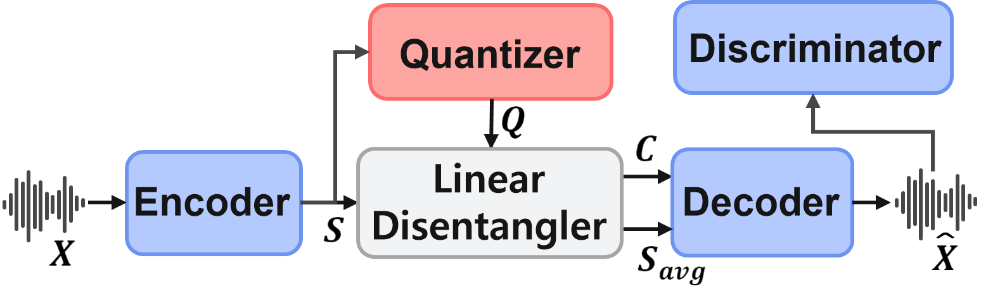

# LinearVC: Linear Disentanglement Leveraging Quantization Residuals from Self-Supervised Learning Features for One-Shot Voice Conversion
---
In this paper, we propose a novel disentanglement-based one-shot VC model that leverages the linear separability of SSL features. Using only K-means quantization and linear operations, the model effectively disentangles speech attributes, capturing both content and speaker-specific information in a unified framework and achieving high-quality voice conversion with reconstruction losses alone.


## Architecture

### 1. Linear Disentangler

<p align="center">
  
</p>

### 2. Full Model Pipeline

<p align="center">
  
</p>

## Results

<p align="center">
  
</p>

---

## Key Features

- **One-Shot Voice Conversion**: Transforms the speaker identity of a source speech into that of an arbitrary target using only a single utterance.
- **Self-Supervised Representations**: Employs features extracted from SSL models like WavLM for robust content and speaker disentanglement.
- **Linear Disentanglement**: Utilizes K-means quantization and linear operations to effectively separate content and speaker attributes.
- **High-Fidelity Output**: Delivers superior performance across multiple objective and subjective evaluation metrics.

---

## Installation

### Prerequisites

- Python 3.8 or higher
- PyTorch 1.10 or higher
- CUDA (for GPU acceleration)


## Usage

### 1. Data Preprocessing

#### a. Downsample Audio
Use `utils/downsampling.py` to downsample audio files to 16kHz.

```bash
python utils/downsampling.py --in_dir [path_to_original_data] --out_dir [path_to_downsampled_data] --sr [sampling_rate]
```
#### b. Extract SSL Features 
Use `preprocess_ssl.py` to extract features from the 6th layer of WavLM.
```bash
python preprocess_ssl.py --in_dir [path_to_original_data] --out_dir [path_to_downsampled_data] --sr [sampling_rate]

```
### 2. Model Training
Train the LinearVC model using the preprocessed data.
```bash
python train.py --config config/config.json --model_dir [ckpt_save_dir_path] --model [model_name]
```

### 3. Voice Conversion
Perform voice conversion using the trained model.
```bash
python convert.py --config ckptdir/config.json --ptfile [checkpoint_pt_file] --src_path [source.wav] --tgt_path [target.wav] --outdir [convert_output_dir]

```
